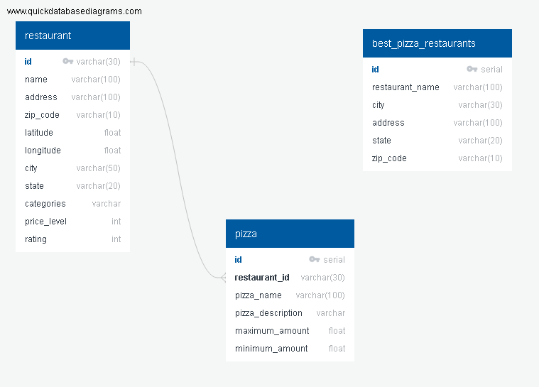

# Datafinity Pizza Restaurants And The Pizza They Sell.


This is a list of over 3,500 pizzas from multiple restaurants provided by Datafiniti's Business Database. The dataset includes the category, name, address, city, state, menu information, price range, and more for each pizza restaurant across all states from USA.

In this project, we have explored the data taken from [Kaggle](https://www.kaggle.com/datafiniti/pizza-restaurants-and-the-pizza-they-sell) and have performed Extraction Transformation and Loading using Python pandas.

Original [dataset](../Resources/Datafiniti_Pizza_Restaurants_and_the_Pizza_They_Sell_May19.csv) from Kaggle had following fields.
```
pizza_data_raw.columns

Index(['id', 'dateAdded', 'dateUpdated', 'address', 'categories',
       'primaryCategories', 'city', 'country', 'keys', 'latitude', 'longitude',
       'menuPageURL', 'menus.amountMax', 'menus.amountMin', 'menus.currency',
       'menus.dateSeen', 'menus.description', 'menus.name', 'name',
       'postalCode', 'priceRangeCurrency', 'priceRangeMin', 'priceRangeMax',
       'province'],
      dtype='object')
```

With the objective of answering below questsions, we have performed cleaning  of this original data set at different stages as below.
```
1)How many different types of pizzas are available?

2)How many pizza restaurants are available?

3)Which is the cheapest type of pizza sold?

4)Which is the most expensive pizza sold?

5)which provice has the maximum number of pizza restaurants?

6)Which city has the maximum number of restaurants?

7)Which is the cheapest and most expesive province for pizza?

8)Which is the cheapest and most expensive city for pizza?

9)Which is the most popular and leasr popular pizza?

10)Which all restaurant offer vegg pizzas based on description?

11)Which all categories of pizzas's are popular?

12)Which days of the week certains pizzas's are availabe?

13)Are any of restaurants identified as best restaurants of the state?

14)Any correlation between between rating found between restaurants of every state against other restaurants of the same state?

```
# Extract

 - Restaurants and Pizza Data from [Kaggle](https://www.kaggle.com/datafiniti/pizza-restaurants-and-the-pizza-they-sell).
 
   Following columns were identified for extraction of data from the original dataset.
   
   
   
 - Additional information like, restaurant name, rating, price_level were extracted from [Google API](https://developers.google.com/places/web-service/details).
 
 - Another dataset of best restaurant from each state for all 50 states in USA were extracted from [Daily Meals](https://www.thedailymeal.com/eat/best-pizza-every-state-slideshow).

# Transform

### Cleaning

  - Selected data had NaN values for pizza description (63%). As pizza description was considered an important feature for determining the price of pizza, decided to remove NaN values from whole dataset for those null rows.  
  - Before Cleaning
  
  !(Before Cleaning)[Images/info.png]
  
  - After Cleaning.
  
  !(After Cleaning)[Images/info-after-nan.png]
  
  - Capitalized pizza description column
  
  - Titalized pizza name column.
  
  - Removed duplicate rows.

### Transform

#### Restaurant

  - As the data had to be finally written into PostgreSQL database, data was normalized and separated into 2 separated dataframes.
  
  - Restaurant - ['id','address', 'postalCode', 'latitude', 'longitude', 'city','province', 'categories']
  
  - 
  
  - Then additional data was collected for every restaurnat usinng it's address, latitude and longitude from Google API Places.
  
  - 

#### Pizza

  - Pizza - ['id', 'menus.name', 'menus.description', 'menus.amountMax', 'menus.amountMin', 'menus.dateSeen']
  
  - All duplicate rows were removed keeping keeping unique records of restaurant id and pizza name.

#### Best Pizza Restaurants by State

  - Data for top pizza restaurant from all 50 states in US was colelcted from [The Daily Meal](https://www.thedailymeal.com/eat/best-pizza-every-state-slideshow/slide-17) site using Splinter and BeautifulSoup. 
  - Originally this datas et had columns [restaurant_name,	city,	state]
  - The using Google API, additional data like Address, Rating and Price_Level were also added.

# Load

### ERD

  
  
  - In postgreSQL, schema was created for pizza_db database and tables for storing restaurant, pizza and best-pizza-stores data.

### Schema Creation

  - Here's the [link](sql/schema.sql] to the all sql for pizza_db creation.

### Connecting to DB from Python Pandas

  - A connection was created in Jupyter notebook to postgres pizza_db database, using sqlalchemy.
  - Using pandas to_sql command, data was written to postgres DB for restaurnat, pizza and best_pizza_restaurants tables.

### Verifying the data in PostgreSQL pizza_db.

   - Here's the [link](sql/query.sql) to all the sql for querying the database for verification.

