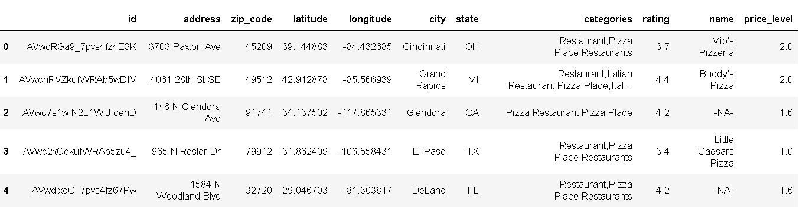

# Datafinity Pizza Restaurants And The Pizza They Sell.

_By Edgar Reyes and Indu Chandrasekharan_


This is a list of over 3,500 pizzas from multiple restaurants provided by Datafiniti's Business Database. The dataset includes the category, name, address, city, state, menu information, price range, and more for each pizza restaurant across all states from the USA.

In this project, we have explored the data taken from [Kaggle](https://www.kaggle.com/datafiniti/pizza-restaurants-and-the-pizza-they-sell) and have performed Extraction Transformation and Loading using Python pandas.

Original [dataset](Resources/Datafiniti_Pizza_Restaurants_and_the_Pizza_They_Sell_May19.csv) from Kaggle had following fields.

Original Meta Data
[raw_meta_data](Images/raw_meta_data.png)

With the objective of answering below questions, we have performed [Data Extraction/Cleaning/Transformation and Loading](scripts/etl_data.ipynb)  of this original data set as below.

```
1)How many different types of pizzas are available in Datafinity stores?

2)How many pizza restaurants are available in each states for Datafinity stores?

3)Which is the cheapest type of pizza sold in Datafinity stores?

4)Which is the most expensive pizza sold in Datafinity stores?

5)which state has the maximum number of pizza restaurants?

6)Which city has the maximum number of restaurants?

7)Which is the cheapest and most expesive state for pizza?

8)Which is the cheapest and most expensive city for pizza?

9)Which is the most popular and least popular pizza?

10)Which all restaurant offer vegg pizzas based on description?

11)Which all categories of pizzas's are popular?

12)Which days of the week certains pizzas's are availabe in Datafinity restaurants?

13)Are any of the restaurants identified as the best restaurants of the state?

14)Any correlation between rating and price level of the top restaurants in each state vs. Datafinity restaurants of the same state?

```
# [Extract](scripts/etl_data.ipynb)

 - Restaurants and Pizza Data from [Kaggle](https://www.kaggle.com/datafiniti/pizza-restaurants-and-the-pizza-they-sell).
 
   Following columns were identified for extraction from the original dataset.
   
   
   
 - Additional information like, restaurant name, [rating](https://developers.google.com/places/web-service/details), [price_level](https://developers.google.com/places/web-service/details) were extracted from [Google API](https://developers.google.com/places/web-service/details).
 
 - Another dataset of best restaurant from each state for all 50 states in USA were extracted from [Daily Meals](https://www.thedailymeal.com/eat/best-pizza-every-state-slideshow).

# [Transform](scripts/etl_data.ipynb)

### Cleaning

  - Selected data had NaN values for pizza description (63%). As pizza description was considered an important feature for determining the price of pizza, we decided to remove NaN values from whole dataset for those null rows.

  - Before Cleaning
  
  - 
  
  - After Cleaning.
  
  - 
  
  - Capitalized pizza description column
  
  - Titalized pizza name column.
  
  - Removed duplicate rows.

  - Columns like postalCode and provice were renamed by zip_code and state as they are told in US.

  - Removed outliers for maximum and minimum amount for pizzas. Ideally, there should be only one amount for a pizza item, but sometimes, same pizza can be sold in slices also and that can result in lower values of pizza amount. We have replaced any 0 or values above 50 with mean values of minimum and maximum of respective amount. As this dataset is containing transactional data as per Kaggle but the data pertaining to pizzas in the menu of different Datafinity restaurants.

  - 

    After cleaning

  - 

### [Transform](scripts/etl_data.ipynb)

#### Restaurant

  - As the data had to be finally written into PostgreSQL database, data was normalized and separated into 2 separated dataframes.
  
  - Restaurant - ['id','address', 'postalCode', 'latitude', 'longitude', 'city','province', 'categories']
  
  - 
  
  - Then additional data was collected for every restaurnat like restaurant name, rating, and price levels using it's address, latitude and longitude from Google API Places. For some restaurants, data was not available in Google API and name was replaced by -NA- and rating and price_level was replaced by mean of rating and mean of price_level as all restaurants belong to one company.
  
  - 

#### Pizza

  - Pizza - ['id', 'menus.name', 'menus.description', 'menus.amountMax', 'menus.amountMin', 'menus.dateSeen']
  
  - All duplicate rows were removed keeping keeping unique records of restaurant id and pizza name.

  - All column names were replaced with more user friendly names as below.

  - 


#### Best Pizza Restaurants by State

  - Data for top pizza restaurant from all 50 states in US was colelcted from [The Daily Meal](https://www.thedailymeal.com/eat/best-pizza-every-state-slideshow/slide-17) site using Splinter and BeautifulSoup. 
  - Originally this datas et had columns [restaurant_name,	city,	state]
  - The using Google API, additional data like Address, Rating and Price_Level were also added.

# Load

### ERD

  - 
  
  - In postgreSQL, schema was created for pizza_db database and tables for storing restaurant, pizza and best-pizza-stores data.

### Schema Creation

  - Here's the [link](sql/schema.sql) to the all sql for pizza_db creation.

### Connecting to DB from Python Pandas

  - A connection was created in Jupyter notebook to postgres pizza_db database, using sqlalchemy.
  - Using pandas to_sql command, data was written to postgres DB for restaurnat, pizza and best_pizza_restaurants tables.

### Verifying the data in PostgreSQL pizza_db.

   - Here's the [link](sql/query.sql) to all the sql for querying the database for verification.

### Answere to some of the questions

  - How many different types of pizzas are available in Datafinity stores?

  - 

  - How many pizza restaurants are available in each states for Datafinity stores?

  - 

  - Which is the cheapest type of pizza sold in Datafinity stores by store names?
    
    

  - Which is the most expensive pizza sold in Datafinity stores?

    

  - Which state has the maximum number of pizza restaurants? (Top 5)

    

  - Which is the most popular pizza by state by selling stores?
    
    

  - Which all restaurant offer vegg pizzas based on description?
    
    

  - Which are the top rated restaurants((top 5)?

   


